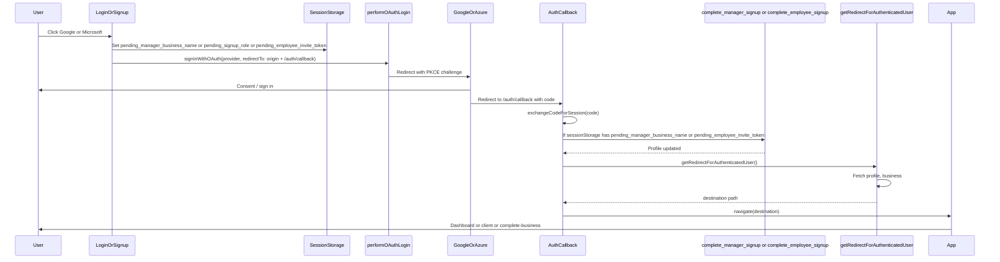

# OAuth Workflow (Google / Microsoft)

This document describes the OAuth (Google and Microsoft) sign-in flow end-to-end, explains the reasoning for each piece (frontend code, Supabase client/storage, migrations, RPCs, RLS policies), and catalogs common errors and fixes. Audience: developers and future maintainers.

---

## 1. Overview

The doc covers:

- **OAuth flow** — Where OAuth starts (Login, Signup, SignupManager), redirect to provider, callback at `/auth/callback`, code exchange, optional RPCs (manager/employee completion), and post-auth routing.
- **PKCE and storage** — Why we use custom auth storage and a cookie for the code verifier; why `detectSessionInUrl: false`; origin consistency (localhost vs 127.0.0.1).
- **Backend** — The `handle_new_user` trigger on `auth.users` INSERT, and the RPCs `complete_manager_signup` and `complete_employee_signup` used after OAuth callback.
- **RLS and policies** — Profiles recursion fix (`is_super_admin()`), “System can insert profiles,” and how they relate to OAuth.
- **Common errors and fixes** — PKCE verifier missing, redirect “loop,” no business_id, legacy accounts, invalid API key / wrong redirect URL, AbortError.

---

## 2. OAuth flow (step-by-step)

### Flow diagram

### Where OAuth is started

OAuth is started from three entry points:

| Page | File | When |
|------|------|------|
| Login | [src/pages/Login.tsx](src/pages/Login.tsx) | User clicks Google or Microsoft on the login page. |
| Signup | [src/pages/Signup.tsx](src/pages/Signup.tsx) | User picks manager/client/employee and clicks a provider; manager must enter business name first. |
| Signup Manager | [src/pages/SignupManager.tsx](src/pages/SignupManager.tsx) | Manager enters business name and clicks a provider. |

All three call [performOAuthLogin](src/lib/authService.ts) in [src/lib/authService.ts](src/lib/authService.ts) with:

- `provider`: `'google'` or `'azure'`
- `options.redirectTo`: `window.location.origin + '/auth/callback'`

So the OAuth callback URL is always the same origin as the app (e.g. `http://localhost:8080/auth/callback`). This ensures the PKCE cookie and redirect share the same origin.

### Why sessionStorage is used before redirect

Before redirecting to the provider, the app stores **pending** context in sessionStorage so that when the user lands back on `/auth/callback`, we know what to do:

| Key | Set when | Used in callback |
|-----|----------|------------------|
| `pending_manager_business_name` | Manager signup: user entered business name and clicked Google/Microsoft | Call `complete_manager_signup(p_business_name)` to create business and link profile. |
| `pending_signup_role` | Client signup: user chose client and clicked a provider | Cleared in callback; redirect logic uses profile.role (client → no business_id). |
| `pending_employee_invite_token` | Employee signup: user had `?invite=TOKEN` and clicked a provider | Call `complete_employee_signup(p_invite_token)` to link profile to business and mark invite accepted. |

If we didn’t store these, the callback would have a session but no way to know whether to run manager or employee completion.

### Callback: AuthCallback.tsx

The OAuth callback is handled by [src/pages/AuthCallback.tsx](src/pages/AuthCallback.tsx).

1. **Code in URL** (`?code=...`): We **explicitly** call `exchangeCodeForSession(code)`. We do **not** rely on Supabase’s automatic “detect session in URL” (that is disabled; see PKCE section). This gives us a single place to exchange and avoids double-exchange (which would consume the verifier and fail).
2. **After session exists**: Read sessionStorage for `pending_employee_invite_token` or `pending_manager_business_name`. If present, call the corresponding RPC (`complete_employee_signup` or `complete_manager_signup`), then remove the key.
3. **Redirect**: Call `getRedirectForAuthenticatedUser()` to get the destination path, then `navigate(destination, { replace: true })` (or `window.location.replace` if navigate fails).

If there is **no** `code` in the URL (e.g. user landed on `/auth/callback` from an email link or direct visit), we fall back to `getSession()`. If a session exists, we still run the same pending RPC logic and redirect.

### Post-auth routing: getRedirectForAuthenticatedUser

[src/lib/authRedirect.ts](src/lib/authRedirect.ts) decides where to send the user after login or OAuth callback:

1. **No user** → `/login`.
2. **Fetch profile** (with a 4s timeout). On error or timeout → `/client` so the user isn’t stuck.
3. **Super admin** (`profile.is_super_admin`) → `/admin`.
4. **No business_id**:
   - If `profile.role === 'client'` → `/client`.
   - Otherwise → `/signup/complete-business` (user must enter business name; e.g. legacy OAuth or manager who didn’t have pending_manager_business_name).
5. **Has business_id** → Fetch business, set business slug in session for routing, then return `getDefaultRoute({ isAdmin: false, business })` (e.g. `/:slug/dashboard`).

This logic is shared by Login, AuthCallback, and CompleteBusiness.

---

## 3. PKCE and storage

### Problem

Supabase Auth uses PKCE. When the user is sent to the provider and then back to `/auth/callback?code=...`, the client must call `exchangeCodeForSession(code)`. That exchange requires the **code_verifier** that was generated when OAuth started. Supabase stores the verifier in localStorage by default. If the user is redirected in the **same tab**, or if storage was cleared, or if the callback runs in a context where that key is missing, the exchange fails with “PKCE code verifier not found” (or similar).

### Solution: custom storage and cookie

1. **Custom auth storage** ([src/integrations/supabase/storage.ts](src/integrations/supabase/storage.ts))  
   We wrap the default storage so that:
   - On **setItem** for the code_verifier key: we write to localStorage **and** to a cookie `sb-pkce-code-verifier` (path `/`, short-lived, SameSite=Lax).
   - On **getItem** for the code_verifier key: we try localStorage first; if empty, we read from the cookie and optionally restore into localStorage so Supabase finds it.

   So even if localStorage is cleared or unavailable during redirect, the verifier can still be recovered from the cookie on the same origin.

2. **Client prefill** ([src/integrations/supabase/client.ts](src/integrations/supabase/client.ts))  
   Before `createClient` runs, if the URL contains `code=` (we’re on the callback), we copy the verifier from the cookie into the same localStorage key Supabase expects. That way the first read by Supabase’s auth layer already sees the verifier.

### Why detectSessionInUrl: false

We set `detectSessionInUrl: false` in the Supabase client auth options. So Supabase does **not** auto-detect the `?code=` and exchange it. Only AuthCallback does the exchange. If both tried to exchange:

- One would succeed and consume the verifier.
- The other would fail with “PKCE code verifier not found.”

By having a single exchange in AuthCallback, we avoid that and keep the flow predictable.

### Origin consistency

Redirect URL and cookies must use the same origin. If the app is opened as `http://127.0.0.1:8080` but the redirect URL in Supabase is `http://localhost:8080/auth/callback`, the cookie might not be sent or might be considered a different origin. [src/lib/canonicalOrigin.ts](src/lib/canonicalOrigin.ts) provides a canonical origin (e.g. normalizing `127.0.0.1` to `localhost`) for use where needed; the auth service uses `window.location.origin` for `redirectTo`, so in local dev you should use one consistent host (e.g. always `localhost:8080`) and add that exact redirect URL in the Supabase dashboard.

---

## 4. Backend: trigger and RPCs

### handle_new_user (trigger on auth.users INSERT)

When a new row is inserted into `auth.users`, a trigger runs `public.handle_new_user()`. This function creates the corresponding row in `public.profiles` and, for email/password signups, can create a business and set role/business_id from metadata.

**Evolution (migrations):**

- [20250120000000_create_multi_tenant_schema.sql](supabase/migrations/20250120000000_create_multi_tenant_schema.sql) — Inserts profile with `id`, `email`, `full_name`.
- [20260203000000_add_profile_role_and_manager_signup.sql](supabase/migrations/20260203000000_add_profile_role_and_manager_signup.sql) — Adds role; manager signup with `business_name` in metadata creates business and profile with business_id.
- [20260203120000_handle_new_user_short_code.sql](supabase/migrations/20260203120000_handle_new_user_short_code.sql) — Adds short_code (and slug) when creating business.
- [20260203130000_handle_new_user_employee_and_complete_employee_signup.sql](supabase/migrations/20260203130000_handle_new_user_employee_and_complete_employee_signup.sql) — Employee branch: valid `invite_token` in metadata → lookup `employee_invitations`, set profile business_id and role, mark invite accepted; else client.

**Logic (current):**

- Reads `raw_user_meta_data`: `signup_role`, `business_name`, `invite_token`.
- **Manager:** `signup_role = 'manager'` and `business_name` set → create business (name, short_code, slug), insert profile with role `manager` and business_id.
- **Employee:** `signup_role = 'employee'` and valid `invite_token` → lookup invite, insert profile with business_id and role `employee`, mark invite accepted.
- **Else:** Insert profile with role `client` (no business_id).

**Why OAuth is different**

For **OAuth** (Google/Microsoft), the user is created by the provider. We do **not** send `business_name` (or invite_token) in Supabase auth metadata at the moment the user is created; we only have that in the frontend (sessionStorage). So when `handle_new_user` runs for an OAuth signup, there is no business_name or invite_token in metadata, and the trigger typically creates a profile with role `client` and no business_id. We then **complete** the flow in the callback by reading sessionStorage and calling:

- `complete_manager_signup(p_business_name)` for managers, or  
- `complete_employee_signup(p_invite_token)` for employees.

So for OAuth, the trigger often creates a “base” profile, and the RPCs fill in business_id and role after the callback.

### complete_manager_signup(p_business_name)

- **Introduced:** [20260203110000_complete_manager_signup_rpc.sql](supabase/migrations/20260203110000_complete_manager_signup_rpc.sql)  
- **Refactored:** [20260203230000_complete_manager_signup_set_profile_helper.sql](supabase/migrations/20260203230000_complete_manager_signup_set_profile_helper.sql)

**Behavior:**

- Requires authenticated user (`auth.uid()`).
- Idempotent: if the profile already has a business_id, the function returns without doing anything.
- Ensures a profile row exists: `INSERT INTO public.profiles (id, email, full_name, role) VALUES (...) ON CONFLICT (id) DO NOTHING`. This covers cases where “handle_new_user may not have run for some OAuth/sso flows.”
- Creates a new business (name, short_code, slug, etc.).
- Calls **set_profile_business_id(uid, new_business_id)** to set the profile’s business_id and role to `manager`. The RPC fails loudly if the update affects 0 rows.

**set_profile_business_id(uid, business_id)**

- SECURITY DEFINER, owned by the same role that owns `public.profiles` (e.g. postgres) so that the UPDATE runs with table-owner privileges and **bypasses RLS**.
- **Reasoning:** RLS on `profiles` was causing infinite recursion when policies themselves queried `profiles` to decide access. Updating the profile from the RPC as the authenticated user would be subject to those policies. By using a definer that bypasses RLS, we guarantee the profile is updated and the manager is linked to the new business without hitting recursion or permission issues.

### complete_employee_signup(p_invite_token)

- **Defined in:** [20260203130000_handle_new_user_employee_and_complete_employee_signup.sql](supabase/migrations/20260203130000_handle_new_user_employee_and_complete_employee_signup.sql)

**Behavior:**

- Used after OAuth callback when sessionStorage had `pending_employee_invite_token`.
- Looks up `employee_invitations` by token (valid, not expired, not already accepted).
- If found: updates the current user’s profile with that business_id and role `employee`, and sets the invite’s `accepted_at`.
- Idempotent: if profile already has business_id, returns without changing anything.

---

## 5. RLS and policies relevant to OAuth

### Profiles recursion fix

Policies on `public.profiles` must **not** SELECT from `public.profiles` when evaluating access to `profiles`, or PostgreSQL can hit infinite recursion.

- **Migration:** [20260203220000_fix_profiles_rls_recursion.sql](supabase/migrations/20260203220000_fix_profiles_rls_recursion.sql)
- **Change:** Introduced a SECURITY DEFINER function `public.is_super_admin()` that reads `profiles` once (as the function owner, bypassing RLS) and returns whether the current user is a super admin. Profiles SELECT/UPDATE policies were replaced to use `(auth.uid() = id) OR public.is_super_admin()` instead of subqueries that selected from `profiles`.

This allows post-OAuth profile reads (e.g. in `getRedirectForAuthenticatedUser`) and RPCs to succeed without recursion.

### “System can insert profiles”

- **Migration:** [20260203200000_remaining_rls_lints.sql](supabase/migrations/20260203200000_remaining_rls_lints.sql)
- **Policy:** `INSERT` on `public.profiles` with `WITH CHECK (id = (SELECT auth.uid()))`.

When a new user is created in `auth.users`, the trigger `handle_new_user` runs. In that context, the “current user” is the newly created user (Supabase sets the JWT for the insert). The trigger inserts a row into `profiles` with `id = NEW.id`. The policy allows that insert because `id` equals `auth.uid()`. Without this, the trigger could not insert the profile row and OAuth (or any signup) would leave users without a profile.

### Consolidation of profiles policies

- **Migration:** [20260203210000_consolidate_multiple_permissive_policies.sql](supabase/migrations/20260203210000_consolidate_multiple_permissive_policies.sql)

Multiple permissive policies on profiles were consolidated. The “Profiles select” and “Profiles update” policies use `auth.uid() = id OR is_super_admin()` (via the helper where applicable) so that after OAuth the app can read/update the user’s own profile and super admins can read/update any profile, without recursion or redundant policies.

---

## 6. Common errors and fixes

| Error / complaint | Cause | What we do |
|-------------------|--------|------------|
| **“PKCE code verifier not found” / “security key was missing”** | Verifier was only in localStorage and was lost on redirect (new tab, cleared storage, or same-tab redirect). | Custom storage backs the verifier in a cookie; client prefills localStorage from the cookie when URL has `code=`. AuthCallback shows a user-facing message: use the same tab and don’t clear site data; try again from the login page. |
| **Redirect to /login after successful OAuth (“loop”)** | Profile fetch failed or timed out (e.g. RLS recursion or slow DB), so `getRedirectForAuthenticatedUser` returned /login or errored. | Profiles RLS recursion fixed with `is_super_admin()`; `set_profile_business_id` bypasses RLS for manager completion; authRedirect uses a 4s profile timeout and falls back to `/client` on profile error so the user isn’t stuck. |
| **Manager OAuth: user has no business_id** | For manager OAuth we don’t pass business_name in auth metadata; handle_new_user creates a profile without business_id. | Callback reads `pending_manager_business_name` from sessionStorage and calls `complete_manager_signup(business_name)`. If that wasn’t set (e.g. user bookmarked callback), they are sent to `/signup/complete-business` ([CompleteBusiness.tsx](src/pages/CompleteBusiness.tsx)) to enter business name and submit; that page calls the same RPC. |
| **Existing accounts without business (legacy OAuth)** | Users who signed up with Google/Microsoft before business name was required have no business_id. | See [EXISTING_ACCOUNTS_NO_BUSINESS.md](EXISTING_ACCOUNTS_NO_BUSINESS.md): redirect to “Complete your account,” or manual SQL to create business and set business_id, or delete the account. |
| **Invalid API key / wrong redirect URL** | Supabase URL and anon key from different projects; or redirect URL in Dashboard doesn’t match app origin. | Per [README-SUPABASE.md](README-SUPABASE.md): use Project URL and anon key from the **same** project; add the exact redirect URL (e.g. `http://localhost:8080/auth/callback` for Vite on 8080) in Authentication → URL Configuration → Redirect URLs. |
| **AbortError / “signal is aborted”** | Supabase auth internals abort requests during navigation. | Client wraps `console.error` and suppresses these messages so the console isn’t spammed during normal navigation. |

---

## 7. References

### Frontend

- [src/lib/authService.ts](src/lib/authService.ts) — `performOAuthLogin`, redirect URL.
- [src/pages/AuthCallback.tsx](src/pages/AuthCallback.tsx) — Code exchange, RPCs, redirect.
- [src/lib/authRedirect.ts](src/lib/authRedirect.ts) — `getRedirectForAuthenticatedUser`.
- [src/integrations/supabase/client.ts](src/integrations/supabase/client.ts) — PKCE prefill, `detectSessionInUrl: false`, `flowType: 'pkce'`.
- [src/integrations/supabase/storage.ts](src/integrations/supabase/storage.ts) — Custom storage and cookie for code_verifier.
- [src/lib/canonicalOrigin.ts](src/lib/canonicalOrigin.ts) — Origin normalization for OAuth/cookies.
- [src/pages/Login.tsx](src/pages/Login.tsx), [src/pages/Signup.tsx](src/pages/Signup.tsx), [src/pages/SignupManager.tsx](src/pages/SignupManager.tsx) — OAuth entry points.
- [src/pages/CompleteBusiness.tsx](src/pages/CompleteBusiness.tsx) — Fallback when user has no business_id.

### Migrations

- [20250120000000_create_multi_tenant_schema.sql](supabase/migrations/20250120000000_create_multi_tenant_schema.sql) — Initial handle_new_user, trigger.
- [20260203000000_add_profile_role_and_manager_signup.sql](supabase/migrations/20260203000000_add_profile_role_and_manager_signup.sql) — handle_new_user manager + role.
- [20260203110000_complete_manager_signup_rpc.sql](supabase/migrations/20260203110000_complete_manager_signup_rpc.sql) — complete_manager_signup RPC.
- [20260203120000_handle_new_user_short_code.sql](supabase/migrations/20260203120000_handle_new_user_short_code.sql) — handle_new_user short_code/slug.
- [20260203130000_handle_new_user_employee_and_complete_employee_signup.sql](supabase/migrations/20260203130000_handle_new_user_employee_and_complete_employee_signup.sql) — handle_new_user employee branch, complete_employee_signup RPC.
- [20260203200000_remaining_rls_lints.sql](supabase/migrations/20260203200000_remaining_rls_lints.sql) — “System can insert profiles,” auth.uid() initplan.
- [20260203220000_fix_profiles_rls_recursion.sql](supabase/migrations/20260203220000_fix_profiles_rls_recursion.sql) — is_super_admin(), profiles policies without recursion.
- [20260203210000_consolidate_multiple_permissive_policies.sql](supabase/migrations/20260203210000_consolidate_multiple_permissive_policies.sql) — Consolidated profiles (and other) policies.
- [20260203230000_complete_manager_signup_set_profile_helper.sql](supabase/migrations/20260203230000_complete_manager_signup_set_profile_helper.sql) — set_profile_business_id, complete_manager_signup profile INSERT and helper.

### Other docs

- [README-SUPABASE.md](README-SUPABASE.md) — Redirect URLs, env vars, troubleshooting.
- [EXISTING_ACCOUNTS_NO_BUSINESS.md](EXISTING_ACCOUNTS_NO_BUSINESS.md) — Legacy accounts without business_id.
