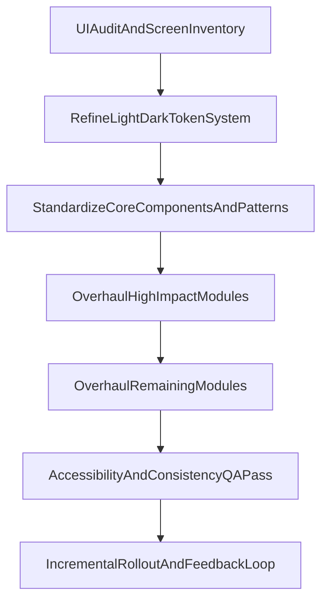

# UI Overhaul Plan (Desktop + Mobile)

## Recommendation On Theme Strategy

- Keep your current **2 themes (light/dark)** and **refine the design token system** first.
- This is the safest path for stability: we improve clarity, hierarchy, and consistency without a risky full theming rewrite.
- Add optional brand accent extensions only after the base system is stable.

## Scope Confirmed

- Include these areas in phase 1: Dashboard, Clients, Pets, Services, Personnel, Reports, Help, Settings (all pages/subpages).
- Optimize for mixed-role users (desktop-heavy + mobile on-the-go).
- Target outcomes: cleaner UI, better completion flow, modernized visual quality.
- Accessibility target: WCAG 2.1 AA.

## Information Architecture + View Inventory

- Audit and inventory page structures and reusable shells in:
  - [src/pages](src/pages)
  - [src/components](src/components)
  - [src/components/ui](src/components/ui)
- Build a screen map by platform:
  - Desktop: dense data + fast action lanes.
  - Mobile: priority tasks first, progressive disclosure for secondary details.
- Define per-screen intent: "scan", "act", "review", "configure".

## UI System Foundation (Tokens + Components)

- Normalize semantic tokens across themes from existing theming files:
  - [src/lib/defaultThemeColors.ts](src/lib/defaultThemeColors.ts)
  - [src/lib/brandingThemePresets.ts](src/lib/brandingThemePresets.ts)
  - [src/lib/businessThemeCss.ts](src/lib/businessThemeCss.ts)
  - [src/components/DemoAwareThemeProvider.tsx](src/components/DemoAwareThemeProvider.tsx)
- Token groups to define/refine:
  - Surfaces (background, elevated cards, overlays)
  - Text hierarchy (primary, secondary, muted, inverse)
  - Borders/dividers and focus rings
  - Status semantics (success, warning, error, info)
  - Action colors (primary, secondary, destructive)
- Keep core color count intentionally small:
  - 1 primary brand hue + neutral scale + semantic status set.
  - Avoid adding many new colors; prefer stronger spacing, typography, and contrast.

## Business Settings Branding Palette Overhaul

- Treat branding palettes in settings as a separate UX system (not only light/dark switching).
- Implement your selected control model: **curated presets + limited custom primary color**.
- Add automatic safety checks when a business picks colors:
  - Contrast validation against text/surfaces.
  - Disabled-save warnings for inaccessible choices.
  - Auto-generated hover/active/focus/soft-background variants from the chosen primary.
- Restrict free customization to high-impact brand tokens only:
  - Primary action
  - Accent/highlight
  - Optional logo/background pairing preview
- Provide live previews for both themes before publish:
  - Desktop card preview
  - Mobile view preview
- Add fallback behavior:
  - If custom color fails constraints, gracefully fall back to nearest safe token value.

## Locked Pre-Build Decisions

- Persist branding choice with explicit `theme_preset_id` in settings (do not infer from colors only).
- Handle existing businesses by auto-migrating current arbitrary colors to nearest curated preset.
- For custom primary selection, auto-generate secondary color via fixed algorithm.
- Enforce palette validation in both client and server layers.

## Card/Block/View Patterns To Standardize

- **Page shells:** header, breadcrumbs/context, primary CTA lane, filters/search area.
- **Data cards:** KPI/stat cards, trend cards, activity cards, profile summary cards.
- **Worklist blocks:** table/list with status chips, quick actions, and row affordances.
- **Detail panels:** entity profile blocks (client/pet/service/personnel) with structured sections.
- **Action surfaces:** modals, drawers/sheets, inline edit forms, confirmation dialogs.
- **Feedback system:** empty states, loading skeletons, success/error banners, toasts.
- **Navigation model:** sidebar + top utility for desktop, bottom/tab + stacked navigation for mobile.

## Mobile/Desktop Behavior Rules

- Define responsive breakpoints and component behavior changes (not just shrinking desktop).
- Mobile priorities:
  - 1 dominant action per screen.
  - Dense tables become stacked cards with key-value compression.
  - Sticky bottom action zones for frequent actions.
- Desktop priorities:
  - Preserve scan efficiency with concise spacing and aligned columns.
  - Keep quick actions visible without modal overuse.

## Accessibility + Usability Guardrails

- Enforce WCAG AA contrast for text, borders, and interactive states in both themes.
- Standardize keyboard focus treatment and visible hover/active/disabled states.
- Define minimum tap/click targets and spacing rhythm.
- Ensure chart and status colors do not rely on color-only meaning.

## Delivery Approach (Low-Risk)

- Phase 1: Design system baseline + top shared components.
- Phase 2: High-impact screens (Dashboard, Clients, Pets, Reports).
- Phase 3: Services, Personnel, Help, Settings.
- Phase 4: Cleanup pass, consistency QA, accessibility QA, and docs.
- Use feature flags or incremental rollout per module to reduce regression risk.

## Overhaul Flow Diagram

## What We Will Decide Next (With You)

- Final visual direction set (2-3 mood directions) based on your reference style.
- Which module starts first for implementation (recommended: Dashboard + Clients).
- How aggressive spacing/typography modernization should be for desktop density.
